# Signal Review

Signal Review is a production-oriented take-home implementation for BeaverMind’s AI-Native Developer exercise. An operator pastes a complete kick-off or coaching transcript, receives a durable UUID report URL immediately, and later reads or downloads an evidence-grounded evaluation.

The central design rule is:

> The LLM interprets the transcript. Deterministic application code enforces the rubric.

The application is deliberately limited to transcript evaluation. It has no recording, transcription, authentication, CRM, upload, or voice-agent surface.

## Architecture

```mermaid
flowchart LR
    O[Operator] -->|POST transcript + call type| A[Next.js API]
    A -->|parse and number turns| T[(Supabase evaluations)]
    A -->|start evaluation UUID| W[Vercel Workflow]
    A -->|202 + persistent URL| O
    W --> E[1. Atomic criterion classification]
    E --> V[Criterion and line verifier]
    V --> S[2. 24 deterministic scoring functions]
    S --> D[3. Caps and calculation validation]
    D --> C[Caps, totals, grade, counterfactual]
    C --> N[4. Narrative synthesis]
    N --> T
    T -->|server-filtered polling| R[Report page]
    T -->|same authoritative data| P[Server PDF renderer]
```



The deployment is a single Next.js application. Vercel Workflow supplies durable orchestration and step retries; Supabase PostgreSQL is the durable state and idempotency boundary. There is no separate worker service.

## Four-stage evaluation pipeline

### 1. Evidence and call facts

`src/lib/transcript/parser.ts` normalizes harmless whitespace, preserves the original input, requires `[Speaker]: text`, and creates stable one-based canonical turns. The entire numbered transcript and the controlled atomic requirement catalog are sent in one request; the transcript is not arbitrarily chunked because evidence for a criterion can occur at distant points in a call. The longer source-rubric prose is not duplicated into this request, which keeps the semantic task focused on the executable criterion contracts.

The model identifies the coach/client speakers and evaluates each required part of every criterion under a strict-reviewer test. It may return only controlled requirement statuses (`SUPPORTED`, `NOT_SUPPORTED`, `CONTRADICTED`, `UNVERIFIABLE`, or `NOT_APPLICABLE`), canonical evidence line numbers, and material assumptions. It does not choose the final criterion state, reproduce quotes, assign scores, choose bands, calculate totals, or write report copy. `src/lib/evaluation/evidence.ts` then checks that:

- every criterion and requirement ID occurs exactly once, with no unknown IDs;
- every supported or contradicted requirement cites direct lines that exist;
- unsupported requirements claim no evidence lines;
- `NOT_APPLICABLE` is accepted only where the source rubric explicitly permits it;
- identified coach and client speakers exist;
- each complete evidence bundle remains within its criterion-specific line limit.

Application code derives the criterion state: all requirements supported with no material assumptions becomes `PRESENT`; partial or unverifiable support becomes `UNCLEAR`; no supported requirement becomes `ABSENT`; and valid inapplicability becomes `NOT_APPLICABLE`. `UNCLEAR` receives no scoring credit. Contradicted and limiting lines are retained as negative evidence for the audit trail.

Application code reconstructs displayed evidence verbatim from the stored transcript turns. There is no model-authored quotation to validate or publish. An invalid classification receives one correction attempt with controlled validation errors; a second failure stops the run safely.

### 2. Deterministic rubric scoring

This stage has no model call. `src/lib/rubrics/criteria/` contains the controlled kickoff/coaching catalogs and twelve explicit scoring functions for each call type. The functions map verified criterion states to allowed rubric values. `UNCLEAR` never earns credit, and optional coaching dimensions are disabled only under their rubric-defined conditions.

Missing behaviours and quick fixes come only from the controlled criterion catalog. They are never free-text model output. Deterministic reasoning names the verified criteria and the exact bucket selected.

### 3. Deterministic verification and calculation

`src/lib/rubrics/config.ts` contains dimension identity, rubric maxima, allowed values, bucket-to-band mappings, caps, grade thresholds, retention-risk tie breakers, and cap-to-dimension counterfactual mappings.

`src/lib/evaluation/calculations.ts` rejects duplicate/missing dimensions, invalid scores, maximum or band mismatches, unsupported N/A states, and evidence outside the verified criteria. It deterministically applies:

- kick-off ranges and half steps;
- coaching discrete buckets;
- kick-off dimension and overall caps;
- coaching D4 movement detection;
- coaching D2 N/A redistribution;
- D5 and D8 defaults;
- non-recoverable D8/D10 zeros;
- weighted/raw/normalized/final totals and grade.

For “the one thing,” every active dimension is independently simulated at full effective value. Only caps mapped to that corrected dimension are removed; unrelated caps remain. Ties resolve by cap removal, retention risk, effective weight, then lower dimension number.

### 4. Report synthesis

Only after the authoritative numbers are persisted does the model write a coach-facing brief, explain the predetermined one thing, and identify evidence-linked client/retention risks. It cannot alter numbers. Red-flag line references must exist in the verified evidence ledger before the narrative is published.

The narrative schema has bounded lengths/counts, and a final safety check blocks internal extraction, validation, retry, or schema wording from client-facing output. These evidence-classification and narrative calls are the only two model calls in a successful evaluation. Both use OpenAI Responses API Structured Outputs parsed by strict Zod schemas behind the replaceable `LLMProvider` interface.

The web report and PDF read the same persisted report rows. PDF generation makes no LLM call.

## Data flow and durability

1. `POST /api/evaluations` validates and canonicalizes the transcript.
2. A queued evaluation row is committed first.
3. `start(evaluateCallWorkflow, [evaluationId])` returns after enqueueing durable work.
4. The evaluation UUID is the application idempotency key. Each model request adds a stable stage key, and `(evaluation_id, stage, schema_version)` is unique in PostgreSQL.
5. Every step checks for a validated stage result before calling the model or repeating calculation.
6. Status transitions are `queued → extracting_evidence → scoring → validating → synthesizing → completed`, or `failed` with a safe code/message.
7. The browser polls the server-filtered status endpoint; it is not part of execution and can close at any time.

Vercel Workflow steps default to bounded retries; this project sets two retries and exponential backoff. Expected validation failures use fatal workflow errors, while transient provider/database failures remain retryable. Completed steps are not repeated because stage outputs are persisted and upserted.

## Project structure

```text
src/
  app/                         # App Router pages and route handlers
  components/                  # Submission, status, and report UI
  lib/
    db/                        # Server-only Supabase client/repository
    errors/                    # Safe error taxonomy
    evaluation/                # Evidence, stages, calculations, public DTOs
    llm/                       # Provider implementation and prompts
    pdf/                       # Server-side client PDF
    rubrics/                   # Deterministic config + complete source rubrics
    transcript/                # Parser and deterministic speaking share
  schemas/                     # Strict Zod contracts
workflows/evaluate-call.ts     # Durable orchestration and retry policy
supabase/migrations/           # Tables, indexes, RLS, helper function
tests/
  fixtures/                    # Supplied transcripts + locked failure regression
  unit/                        # Parser, evidence, rubric, calculation invariants
  integration/                 # Mocked pipeline, retries, idempotency, PDF route
```

## Technology choices

- Next.js App Router, React 19, strict TypeScript, and Tailwind CSS 4.
- Supabase PostgreSQL for durable report, dimension, and stage state.
- Vercel Workflow SDK for background execution that survives request/browser lifetime.
- Zod 4 for request, model response, and internal structured validation.
- OpenAI SDK Responses API behind a replaceable provider abstraction.
- `@react-pdf/renderer` for server-side PDFs from persisted report data.
- Vitest for unit and integration coverage.

## Setup

Prerequisites: Node.js 20+ (Node 22 LTS recommended), npm, a Supabase project, a Vercel account, and an OpenAI API key.

```bash
npm install
cp .env.example .env.local
```

Set these server environment variables:

| Variable | Purpose |
|---|---|
| `SUPABASE_URL` | Supabase project URL |
| `SUPABASE_SERVICE_ROLE_KEY` | Server-only Data API key; never exposed to the browser |
| `LLM_PROVIDER` | `openai` for the included provider |
| `LLM_API_KEY` | Server-only OpenAI key |
| `LLM_MODEL` | Model name; recommended `gpt-5.4-mini` |
| `LLM_TIMEOUT_MS` | Provider timeout, default/recommended `180000` |
| `APP_BASE_URL` | Public origin, e.g. `http://localhost:3000` |

No model name or credential is hardcoded in production code.

### Supabase migration

Link the Supabase CLI to the target project and apply all checked-in migrations:

```bash
npx supabase login
npx supabase link --project-ref <project-ref>
npx supabase db push
```

The migrations create `evaluations`, `dimension_results`, and `evaluation_stage_results`, add the operator-declared diagnostics context, plus status/time indexes and the atomic attempt-counter function. RLS is enabled with no anon/authenticated policies. Public report reads are deliberately proxied through server routes using the dedicated service-role client; browser code never receives a Supabase key.

### Local development

```bash
npm run dev
```

The Workflow SDK runs locally with Next.js. Optional workflow observability is available in a second terminal:

```bash
npm run workflow:dev
```

Open `http://localhost:3000`.

### Tests and checks

```bash
npm run lint
npm run typecheck
npm test
npm run test:coverage
npm run build
```

All four supplied transcripts are copied into `tests/fixtures`, alongside the exact transcript that exposed the original scoring bug. Tests exhaust every binary path through all 24 scoring functions and lock that regression to the approved dimension scores and 52.5/100 total.

## API examples

Create an evaluation:

```bash
curl -i http://localhost:3000/api/evaluations \
  -H 'content-type: application/json' \
  -d '{
    "callType": "kickoff",
    "transcript": "[Coach]: Welcome.\n[Client]: Thanks.\n[Coach]: What matters most?\n[Client]: Being active with my family."
  }'
```

The `202` response contains `id`, `status`, `url`, and a `Location` header. Fetch status/report data with:

```bash
curl http://localhost:3000/api/evaluations/<uuid>
```

Download the completed PDF with:

```bash
curl -o report.pdf http://localhost:3000/api/evaluations/<uuid>/pdf
```

## Deployment to Vercel

1. Create a separate public GitHub repository; do not push or open a PR against the source exercise repository.
2. Import the repository into Vercel.
3. Add every `.env.example` variable to Production and Preview environments. Set `APP_BASE_URL` to the deployed origin.
4. Ensure Fluid Compute is enabled (new Vercel projects enable it by default).
5. Apply the Supabase migration before accepting submissions.
6. Deploy with the normal Next.js build. The `withWorkflow` wrapper registers the workflow and step directives.
7. Run one supplied fixture end to end, close the browser during execution, reopen the UUID, and download/inspect the PDF.

## Security and privacy

- Service-role and LLM keys live only in server environment variables.
- RLS plus revoked anon/authenticated privileges prevents arbitrary public mutation.
- Public URLs use unguessable UUIDv4 identifiers; there is no directory/list endpoint.
- API responses are explicit public DTOs and exclude transcript, internal diagnostics, provider errors, and workflow identifiers.
- Public error messages never include stack traces or raw provider payloads.
- Ordinary application/workflow logs include evaluation ID and stage only; prompts and transcript contents are not logged.
- The provider uses `store: false`; actual retention still depends on the selected provider/account policy.
- A production retention/deletion policy should be agreed before processing real client transcripts.

## Reliability and scaling

- Stage-level unique constraints and upserts make retries safe.
- LLM calls have stable idempotency keys, provider timeouts, bounded retries, and exponential backoff.
- The workflow passes only the UUID between stages; large transcripts remain in PostgreSQL rather than workflow event history.
- Status and creation indexes support queue/operations views without scanning transcripts.
- The 100,000-character limit safely covers the 64.8 kB fixture while bounding prompt and database cost.
- Supabase and the workflow queue support concurrent evaluations without in-memory job state.
- Rate limiting belongs at `POST /api/evaluations`; the extension point is intentionally documented rather than backed by process memory, which is incorrect under serverless concurrency. Use Vercel Firewall rate limits or a durable Redis/Postgres token bucket keyed by hashed IP before public production use.
- `LLMProvider` is the failover seam; add another implementation and route retryable provider failures there without touching rubric logic.

## Assumptions and known limitations

1. **D2 N/A redistribution:** D3 and D4 retain their original discrete scores. With active D4, five maximum-weight points go to each proportionally; with disabled D4, all ten go to D3. Totals remain 100 or 85.
2. **Coaching source arithmetic:** the published coaching dimension maxima add to 105 although the same rubric explicitly declares 100, and 85 with D4 disabled. To honor the declared totals and preserve the full ten-point D2 redistribution, D5 keeps its displayed/scored `0/3/7/10` bucket but carries five effective points. This is visible in report data and is a required client clarification; it is not hidden.
3. **Speaking share:** calculated deterministically from non-whitespace transcript characters by identified speaker. The qualitative engagement condition is a controlled atomic criterion, not free-form model reasoning.
4. **No chunking:** the full transcript and atomic requirement catalog must fit the chosen model context. Inputs above 100,000 characters are rejected instead of silently truncated.
5. **Polling:** controlled polling is used instead of Supabase Realtime to avoid exposing a browser Supabase key. It pauses after 15 minutes while durable work continues; refresh always obtains current state.
6. **PDF storage:** PDFs are rendered on demand from durable report rows and can be cached. A storage bucket is unnecessary at this exercise volume.
7. **Public-link privacy:** UUID secrecy is the access model because authentication is out of scope. Revocation/expiry requires a product decision.
8. **Source rubric packaging:** complete rubric Markdown remains checked in as the human-readable source; executable semantic contracts and deterministic scoring rules live separately in TypeScript.

## Client clarification questions

- Which coaching dimension should account for the five-point discrepancy between the listed 105 points and declared 100? Is the temporary D5 effective weighting correct?
- Confirm the D2 redistribution arithmetic and how it should interact with D4 being disabled.
- Should “booked live” require observed calendar confirmation, or is unambiguous verbal date/time agreement sufficient for coaching D10?
- What retention/deletion period and geographic processing requirements apply to real transcripts?
- Which provider/model is approved, and are zero-data-retention controls required?
- Should a report link be permanent, revocable, or expiring once authentication enters scope?
- What traffic threshold and identity key should the production submission rate limit use?

## Known compromises and future improvements

Within exercise scope, this build uses polling, on-demand PDFs, one provider, and UUID bearer links. Natural next steps are provider failover, durable rate limiting, operational re-drive tooling for failed runs, telemetry dashboards using IDs/stages only, report-link revocation, a signed PDF cache in Supabase Storage, prompt/rubric admin versioning, and a broader reviewer-approved golden-score corpus.

## Suggested Loom walkthrough

1. Submit one strong and one weak supplied transcript; copy the UUID and close the tab during processing.
2. Show the Workflow timeline and Supabase stage rows to demonstrate durability/idempotency.
3. Open the atomic requirement schema and show that the model returns support statuses, line references, and material assumptions—but no quote, final criterion verdict, score, or missing-behaviour fields.
4. Open the 24 scoring functions and deterministic calculations; demonstrate a cap, D4 disable, D2 redistribution, and “one thing” simulation.
5. Reopen the report URL, inspect a dimension, and download the PDF.
6. Run the tests and show the exact 52.5 regression, exhaustive scoring branches, internal-language guard, and provider-failure case.
7. Close with the 105-vs-100 coaching ambiguity, the D2 assumption, security boundaries, and what you would build next.

## Authoritative sources

- [BeaverMind exercise](https://ops.beavermind.ai/hiring-ai-dev/exercise)
- [Source repository and README](https://github.com/lukecala/hiring-ai-dev-exercise)
- [Kick-off rubric](https://github.com/lukecala/hiring-ai-dev-exercise/blob/main/rubrics/kickoff-call-rubric.md)
- [Coaching rubric](https://github.com/lukecala/hiring-ai-dev-exercise/blob/main/rubrics/coaching-call-rubric.md)
- [Vercel Workflow documentation](https://vercel.com/docs/workflows)
- [Supabase documentation](https://supabase.com/docs)
- [OpenAI Responses API](https://developers.openai.com/api/reference/resources/responses/methods/create)
